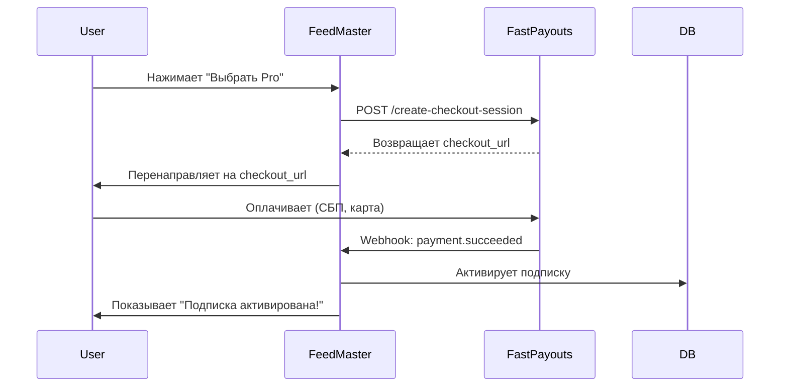

## 1. 🔍 **Общее описание платформы**

**FeedMaster** — это **интеллектуальная система автоматического сбора, фильтрации и публикации контента в Telegram-каналы**.

### Основная цель
Помочь владельцам каналов, маркетологам, аналитикам и сообществам:
- Автоматически находить релевантный контент по ключевым словам
- Фильтровать спам, дубликаты и нежелательные темы
- Публиковать отобранные материалы с возможностью ручной модерации
- Управлять несколькими ботами и источниками через единый интерфейс

---

## 2. 🎯 **Ключевые ценности (USP)**

| Преимущество | Описание |
|-------------|---------|
| **Многоисточниковость** | RSS, сайты, Telegram-каналы (включая закрытые), внешние API |
| **Глубокая фильтрация** | Ключевые слова, чёрные списки, NLP, семантический анализ |
| **Полный контроль** | Режим ручной модерации перед публикацией |
| **SaaS + Self-Hosted** | Доступна как облачная платформа и как локальное решение |
| **Поддержка РФ** | Локализация, российские платежные системы, соответствие законодательству |
| **Безопасность** | Шифрование токенов, RBAC, аудит действий, защита от злоупотреблений |

---

## 3. 🧩 **Архитектура системы**

```
[Frontend: Next.js + React]
         ↓
[Backend: FastAPI / Node.js]
         ↓
   [Workers: Celery / Arq]
         ↓
[Sources: RSS, Web, Telethon, APIs]
         ↓
[Telegram Bot API] → [Канал]
         ↑
[Admin Panel] ←→ [Database (PostgreSQL)]
```

### Ключевые компоненты:
- **Frontend**: Next.js App Router, ShadCN UI, Tailwind CSS, `next-intl` для локализации
- **Backend**: Асинхронный API для управления ботами, источниками, модерацией
- **Workers**: Парсеры, сканирование источников по расписанию
- **Telethon**: Для чтения закрытых Telegram-каналов (через пользовательский аккаунт)
- **База данных**: PostgreSQL (мультитенантная структура)
- **Админ-панель**: Центр управления для владельца платформы

---

## 4. 👥 **Типы пользователей и их роли**

| Роль | Доступ | Назначение |
|------|--------|-----------|
| **User (пользователь)** | Базовый доступ: модерация, просмотр, настройка своих ботов | Владелец канала |
| **Moderator (модератор)** | Только модерация и просмотр | Помощник, администратор канала |
| **Administrator (админ)** | Полный доступ ко всем функциям своей организации | Управляет командой |
| **Owner (владелец платформы)** | Полный контроль над всей системой: пользователи, биллинг, безопасность | Владелец SaaS/self-hosted платформы |

---

## 5. 🔄 **Пользовательские потоки (User Flows)**

### 5.1. **User Flow (новый пользователь)**
1. Переходит на `feedmaster.app`
2. Нажимает "Начать бесплатно"
3. Регистрируется через email или Google
4. Проходит **онбординг**:
   - Добавляет первого бота (вводит токен)
   - Выбирает целевой канал
   - Добавляет первый источник (RSS/Telegram)
   - Настраивает ключевые слова
5. Перенаправляется на `/dashboard`
6. Видит карточки, график активности, начинает модерировать

---

### 5.2. **Admin Flow (администратор организации)**
1. Заходит в систему
2. Создаёт новых пользователей (модераторов)
3. Настраивает несколько ботов
4. Управляет источниками, шаблонами публикаций
5. Мониторит статистику и эффективность
6. Обновляет тариф при росте потребностей

---

### 5.3. **Owner Flow (владелец платформы)**
1. Заходит в `/admin/dashboard`
2. Видит MRR, количество пользователей, churn rate
3. Просматривает подозрительную активность
4. Приостанавливает пользователя за нарушение правил
5. Проверяет системный статус self-hosted инсталляций
6. Управляет биллингом, тарифами, поддержкой

---

## 6. 💰 **Модели предоставления услуг**

### 6.1. **SaaS (Software as a Service)**

#### Как работает:
- Пользователь регистрируется на `feedmaster.app`
- Выбирает тариф: Free / Pro / Team / Enterprise
- Оплачивает через **FastPayouts / PayApp** (СБП, Tinkoff, ЮKassa)
- Использует платформу в облаке

#### Преимущества:
- Нулевая установка
- Автоматические обновления
- Поддержка 24/7
- Безопасность на уровне провайдера

---

### 6.2. **Self-Hosted (локальная установка)**

#### Как работает:
- Пользователь покупает лицензионный ключ
- Скачивает Docker-образ или ZIP
- Устанавливает на свой сервер
- Активирует через веб-интерфейс с ключом
- Получает обновления по подписке

#### Преимущества:
- Полный контроль над данными
- Соответствие внутренним политикам безопасности
- Работа без интернета (частично)
- Интеграция с внутренними системами

---

### 6.3. **Standalone (только для себя)**

#### Как работает:
- Разработчик устанавливает FeedMaster локально
- Использует только свои боты и источники
- Не открывает доступ другим пользователям
- Может использовать без биллинга

#### Цель:
- MVP, тестирование, персональное использование

---

## 7. 💳 **Бизнес-логика биллинга**

### 7.1. **Цель**
Создать **гибкую, безопасную и легальную** систему монетизации, соответствующую требованиям РФ и международным стандартам.

### 7.2. **Выбранное решение**
> ✅ **Делегированный биллинг через FastPayouts / PayApp**, с возможностью перехода на собственную систему.

#### Почему:
- Готовое решение с поддержкой **СБП, Тинькофф, Сбербанк, ЮMoney**
- Автоматическая генерация чеков (соответствие 54-ФЗ)
- Простая интеграция через REST API
- Отсутствие зависимости от Stripe/PayPal

---

### 7.3. **Процесс оплаты**



---

### 7.4. **Управление подпиской**

- **Интерфейс**: `/settings/billing`
- **Функции**:
  - Просмотр текущего тарифа
  - Скачать счет/чек
  - Отменить подписку
  - Изменить способ оплаты (через Customer Portal)

---

## 8. 🛠 **Работа с ботами и аккаунтами**

### 8.1. **Добавление бота**
1. Пользователь создаёт бота через @BotFather
2. Получает токен
3. Вводит его в `/bots/add`
4. FeedMaster проверяет токен (`getMe`)
5. Запрашивает ID канала (куда бот должен публиковать)
6. Сохраняет данные (токен шифруется)

---

### 8.2. **Публикация контента**
- **Бот не принимает решений**
- Вся логика — в backend:
  1. Сбор → Фильтрация → Модерация → Решение о публикации
  2. Backend вызывает Telegram Bot API → бот публикует

✅ Так обеспечивается **безопасность, контроль и масштабируемость**.

---

## 9. 🌐 **Управление источниками**

### Поддерживаемые типы:
| Тип | Метод |
|-----|-------|
| **Open Telegram** | Парсинг `https://t.me/s/username` |
| **Приватный канал** | Через Telethon + invite-ссылка |
| **RSS** | `feedparser` |
| **Веб-сайт** | BeautifulSoup + XPath/CSS |
| **Внешние API** | NewsAPI, Reddit, Twitter/X |

### Фильтрация:
- По ключевым словам (AND/OR)
- По чёрному списку
- По языку, типу контента, дате

---

## 10. 🧑‍💼 **Управление пользователями и ролями**

### Реализация:
- **Firebase Auth** — аутентификация
- **RBAC** — управление ролями
- **Админ-панель** — назначение ролей, приглашение

### Особенности:
- Модератор видит только модерацию
- Админ управляет своими ботами и пользователями
- Owner видит всю систему

---

## 11. 📊 **Тарифные планы**

| План | Цена | Функции |
|------|------|--------|
| **Free** | $0 | 1 бот, 3 источника, базовая модерация |
| **Pro** | $19/мес | 3 бота, 15 источников, Telegram, AI-суммаризация |
| **Team** | $49/мес | 10 ботов, 50 источников, команда до 5 человек |
| **Enterprise** | от $99/мес | Неограниченно, self-hosted, SLA, SSO |

---

## 12. 🔒 **Безопасность и защита**

### Ключевые меры:
| Область | Защита |
|--------|--------|
| **Токены ботов** | Шифруются (Fernet), хранятся в БД |
| **Webhooks** | Проверяются по цифровой подписи |
| **Доступ к API** | JWT + RBAC |
| **Админ-панель** | Только для `owner`, 2FA (опционально) |
| **Данные** | HTTPS, CORS, rate limiting |
| **Лицензии (self-hosted)** | Привязка к fingerprint сервера |

---

## 13. 🚀 **Эволюционность архитектуры**

FeedMaster спроектирована так, чтобы легко развиваться:

| Этап | Возможность |
|------|------------|
| **MVP** | JSON + Next.js API Routes |
| **Growth** | PostgreSQL + FastAPI + Workers |
| **Scale** | Microservices, Kubernetes, LLM-обработка |
| **Monetization** | SaaS + Self-Hosted + Hybrid |

---

## 14. 🏆 **Конкурентные преимущества**

| Конкурент | FeedMaster |
|----------|------------|
| **Telegram Bots (ручные)** | Автоматизация, масштабирование |
| **IFTTT / Zapier** | Глубокая фильтрация, модерация |
| **ParseHub + ручная публикация** | Полный цикл: сбор → модерация → публикация |
| **Чужие SaaS-агрегаторы** | Поддержка РФ, СБП, self-hosted |

---

## 15. 📈 **KPI и метрики успеха**

| Метрика | Цель (через 12 месяцев) |
|--------|--------------------------|
| MRR | ₽5 000 000+ |
| Количество пользователей | 10 000+ |
| Churn rate | < 5% |
| Conversion (Free → Paid) | > 15% |
| DAU/MAU | > 40% |

---

## 16. 🤝 **Стратегия развития**

| Этап | Задача |
|------|-------|
| **0–3 мес** | Запуск MVP, привлечение первых 1000 пользователей |
| **4–6 мес** | Запуск SaaS, интеграция с FastPayouts |
| **7–9 мес** | Self-hosted версия, enterprise-тариф |
| **10–12 мес** | Расширение на СНГ, интеграции (Notion, Airtable) |

---

## 17. 📁 **Приложения (для презентации)**

1. **Скриншоты интерфейса**: Dashboard, Moderation, Admin Panel
2. **Схема архитектуры**
3. **Графики роста (прогноз)**
4. **Сравнение с конкурентами**
5. **Roadmap продукта**
6. **Команда разработки**
7. **Финансовая модель (CAPEX, OPEX, ROI)**

---

## ✅ **Заключение**

**FeedMaster** — это не просто бот, а **полноценная система управления информационным потоком**.

Она сочетает:
- **Автоматизацию** и **контроль**
- **Масштабируемость** и **локальную автономность**
- **Безопасность** и **удобство использования**

Платформа готова к выходу на рынок SaaS и self-hosted решений, с полной поддержкой российских реалий и глобальных стандартов.

